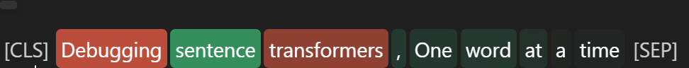

<!-- <table width='100%' style='border-collapse: collapse; margin-top: 20px;'>
  <tr>
    <td>
      <span class='word' style='cursor: pointer; padding: 2px 4px; border-radius: 4px; position: relative; display: inline-block; text-decoration: none;'>[CLS]</span>
      <span class='word' style='background-color: rgba(255, 99, 71, 0.7); color: white; font-size: 24px; padding: 4px 6px; border-radius: 6px;' data-tooltip='Importance: -0.70'>Debugging</span>
      <span class='word' style='background-color: rgba(60, 179, 113, 0.7628632071477993); color: white; font-size: 24px; padding: 4px 6px; border-radius: 6px;' data-tooltip='Importance: 0.76'>sentence</span>
      <span class='word' style='background-color: rgba(255, 99, 71, 0.5); color: white; font-size: 24px; padding: 4px 6px; border-radius: 6px;' data-tooltip='Importance: -0.50'>transformers</span>
      <span class='word' style='background-color: rgba(60, 179, 113, 0.18407592577718224); color: white; font-size: 24px; padding: 4px 6px; border-radius: 6px;' data-tooltip='Importance: 0.18'>,</span>
      <span class='word' style='background-color: rgba(60, 179, 113, 0.16509186059987302); color: white; font-size: 24px; padding: 4px 6px; border-radius: 6px;' data-tooltip='Importance: 0.17'>One</span>
      <span class='word' style='background-color: rgba(60, 179, 113, 0.16934483485599225); color: white; font-size: 24px; padding: 4px 6px; border-radius: 6px;' data-tooltip='Importance: 0.17'>word</span>
      <span class='word' style='background-color: rgba(60, 179, 113, 0.13370410645376962); color: white; font-size: 24px; padding: 4px 6px; border-radius: 6px;' data-tooltip='Importance: 0.13'>at</span>
      <span class='word' style='background-color: rgba(60, 179, 113, 0.04820539824234946); color: white; font-size: 24px; padding: 4px 6px; border-radius: 6px;' data-tooltip='Importance: 0.05'>a</span>
      <span class='word' style='background-color: rgba(60, 179, 113, 0.05061600556547035); color: white; font-size: 24px; padding: 4px 6px; border-radius: 6px;' data-tooltip='Importance: 0.05'>time</span>
      <span class='word' style='font-size: 24px; padding: 4px 6px;'>[SEP]</span>
    </td>
  </tr>
</table>

<style>
.word {
  cursor: pointer;
  padding: 4px 6px;
  border-radius: 6px;
  position: relative;
  display: inline-block;
  text-decoration: none;
  font-size: 24px; /* Increase font size for header-like text */
}

.word:hover::after {
  content: attr(data-tooltip);
  position: absolute;
  top: -35px;
  left: 0;
  background: #333;
  color: #fff;
  padding: 5px 10px;
  border-radius: 4px;
  white-space: nowrap;
  z-index: 10;
  box-shadow: 0px 4px 6px rgba(0, 0, 0, 0.1);
  font-size: 12px;
}
</style> -->




## Sentence transformers explainer
This repository contains an implementation of a method to explain sentence-transformers relevance of Inputs. Specially this repo is based in a 'similarity' task, and getting the relevance for words in a sentence when comparing it to another. This could help in understanding retrievers for RAG systems, and knowing what is our 'Sentence embedding' taking into account.

The development is based in the 'Captum' library, and specially in this tutorial [Bert Tutorial](https://captum.ai/tutorials/Bert_SQUAD_Interpret).


## Installation

1. Clone this repository in a directory

2. Move to the repository folder

3.  Create a python virtual environment.

```python

python3 -m venv <your_env>
```


4.  Activate the environment in the folder from terminal

```
./<your_env>/Scripts/activate
```

or in linux OS

```
./<your_env>/bin/activate
```


## Development Tutorial

Right now all the development can be found in the [Introduction tutorial](./st-explainer_method.ipynb)


